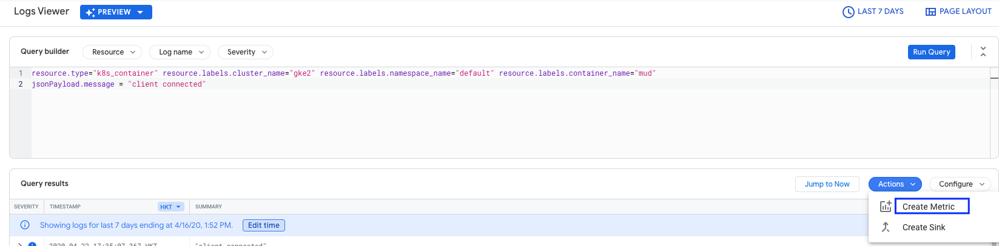
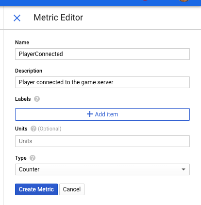
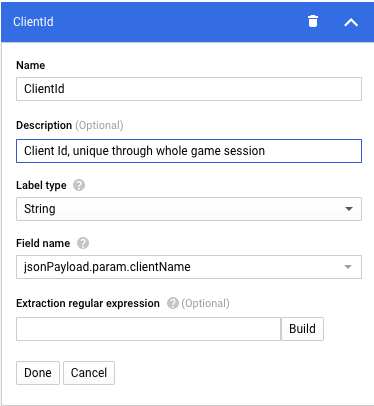

Overview
========

為了更好的監控遊戲運行的狀態, 接下來我想要將遊戲內的資訊寫到Stackdriver中, 以方便查詢跟Troubleshooting.
在GKE上Kubernetes Engine Monitoring是預設開啟的, 因此我需要做的就是在程式中將我的訊息格式好. 預設會收集[System Log和Applicaton Log](https://cloud.google.com/monitoring/kubernetes-engine/installing), 應用程式的stdio, stderr訊息也會被收集, 然而, 其格式是文字格式, 不易查詢. 
在Stackdriver支援[Structured Logs](https://cloud.google.com/logging/docs/structured-logging?hl=zh-tw), 我們可以透過API格式化要送到Stackdriver Logging中的訊息

Steps
=====

我們有幾個Client Library的[選擇](https://cloud.google.com/logging/docs/setup/nodejs#installing_the_plugin_2), 在這邊我使用Winston

依照文件的步驟安裝node.js package, 並修改`logger.js`

```javascript
const {LoggingWinston} = require('@google-cloud/logging-winston');
const loggingWinston = new LoggingWinston();

const logger = winston.createLogger({
  level: 'info',
  transports: [
    new winston.transports.Console(),
    loggingWinston,
  ],
});


module.exports = function log(msg, param, source, severity) {
    logger.info({
        message:msg,
        timestamp:Date.now(),
        param:param,
        source:source,
        severity:severity
    });
};
```

這樣就完成了, 之後遊戲中透過`log()`紀錄的Log, 都會以Json的格式送到Stackdriver上, 並記錄在`jsonPayload`欄位
在Stackdriver上就可以用類似以下的語法去查詢相關紀錄.

例如我要查玩家連線的相關紀錄, 就可以以下面的查詢去取得
```ini
resource.type="k8s_container"
resource.labels.cluster_name="gke2"
resource.labels.namespace_name="default"
resource.labels.container_name="mud"
jsonPayload.message = "client connected"
```

Logs-based Metrics
==================

也可以將這樣的紀錄設定成為Logs-based Metrics作為監控之用


按下Create Metric之後, 會跳到建立頁面, 確認所有條件符合之後, 在右邊Metric Editor填上Metric資訊



如果這個Metric有其他重要資訊, 也可以透過Label的方式匯出



設定完成後, 就可以在Monitoring中監控這個Metrics
