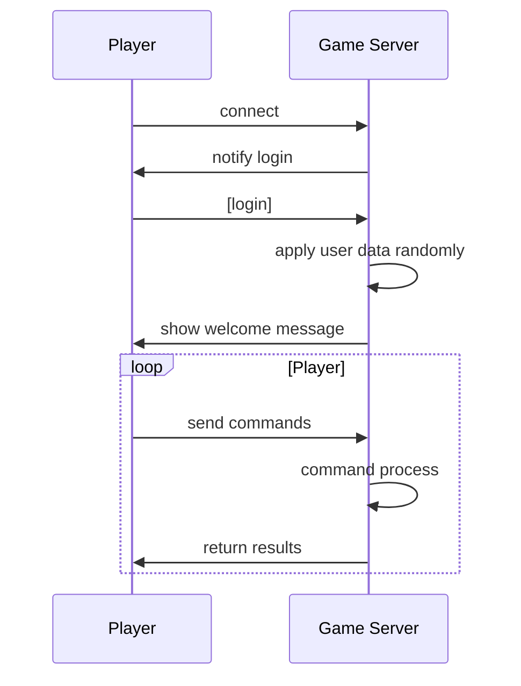

## Overview

I am writting a very basic text-based game which allows players to connect via websocket clients, input commands and interact with other players. A simple MUD (multi-user dungeon) game.

The game server is accepting websocket connection on port 8080 or 9999, depends on runtime environment.

## Flow Chart

Install [Mermaid chrome extension](https://chrome.google.com/webstore/detail/mermaid-diagrams/phfcghedmopjadpojhmmaffjmfiakfil) to view below flow diagram

