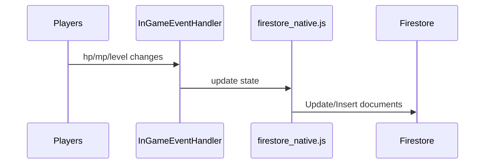
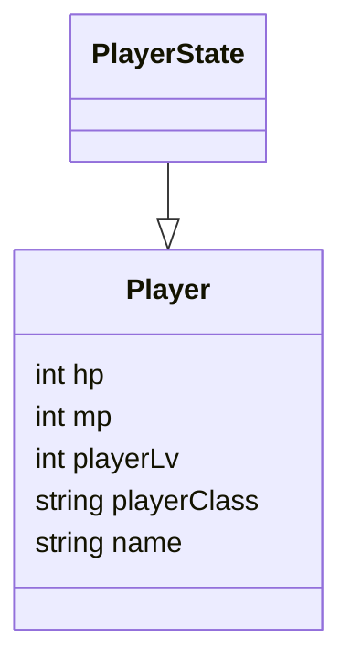
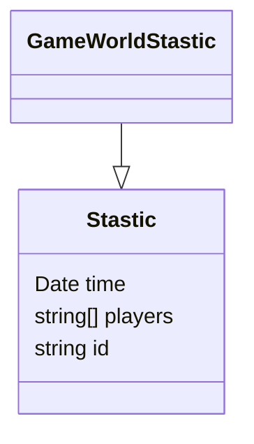
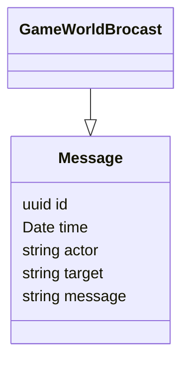

## Overview

Firestore is the next version of Firebase and takes the best of Cloud Datastore and Firebase realtime. Adding Firestore real-time capabilities to the game enables players or game developers get live updates across the game world.

In this case, everytime when in-game player state changes, such as attacked by other players, the [game](./game-core/utils/firestore_native.js) updates Firestore collections to reflect latest player state. When players login or logout the game, latest player stastics are updated to Firestore. A Firestore snapshot listener gets latest updates from Firestore in near real-time.

### Firestore Design

At the moment it's still very simple design

- PlayerState collection collects individual player state

- GameWorldStastic have latest in-game player lists

-   GameWorldBrocast logs every broadcast messages

