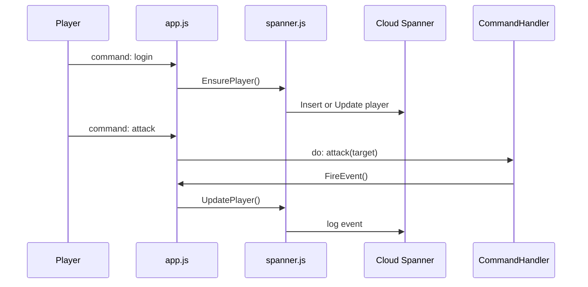

## Overview

### Add Node Pool with Spanner access

Default GKE node pool does not have access to Cloud Spanner, if you didn't configure access permission when creating the cluster you will have to create a new node pool with Spanner access first.

```shell
export PROJECT_ID=kalschi-agones
export NODEPOOL_NAME=gke-spanner-pool
export CLUSTER_NAME=game-gke
gcloud beta container --project $PROJECT_ID node-pools create $NODEPOOL_NAME \
     --cluster $CLUSTER_NAME --zone "asia-east1-a" --node-version "1.14.10-gke.17" --machine-type "n1-standard-1" --image-type "COS" --disk-type "pd-standard" --disk-size "100" --metadata disable-legacy-endpoints=true --scopes "https://www.googleapis.com/auth/cloud-platform" --num-nodes "1" --enable-autoupgrade --enable-autorepair
```

You may than delete default node pool or use node selector to have your Pods scehduled in new node pool.

### Spanner Integration

Install Google Clud Spanner node sdk if not already

```shell
npm install @google-cloud/spanner -s
```

Go to Spanner and create a table

```sql

CREATE TABLE players (
    id STRING(36) NOT NULL,
    name STRING(36) NOT NULL,
    hp INT64 NOT NULL,
    mp INT64 NOT NULL,
    playerClass STRING(16) NOT NULL,
    playerLv INT64 NOT NULL,
) PRIMARY KEY (id, name)
CREATE INDEX PlayerProfile ON players(name, playerClass, playerLv)
```

Now we have Spanner and tables ready, we can than integrate our game with [Spanner](./game-core/utils/spanner.js). A high level overview of how event results are logged to Spanner is shown below.



### [Firestore Integration](./firestore_native.md)

Also to get real time updates from in-game world, I integrated with [Firestore](./firestore_native.md)

### Update Dockerfile and Yaml files

To use Spanner node.js SDK we need to make sure our environment runs grpc, I've updated my [Dockerfile](./game-core/Dockerfile) to reflect new requirements.

Our yaml files need to be modified to reflect new ports as well, I now need to pass in environment contains my [Spanner connection info](./k8s/mud-deployment.yaml)

### Deploy

```shell
sudo docker build . -t gcr.io/$PROJECT_ID/mud:latest
sudo docker push gcr.io/$PROJECT_ID/mud:latest
kubectl apply -f ./k8s/mud-deployment.yaml
kubectl apply -f ./k8s/mud-service.yaml
kubectl apply -f ./k8s/mud-ingress.yaml
```

### Verify

I have a simple websocket client created to test game server, run below node application and start with "login" command to login as player

```bash
cd ./tests
node test-ws
```

You should see messages coming from game server like below.

```shell
node test-ws
undefined
Game>>::ffff:130.211.2.93:58977 type login [name] to login to the game
Game>>login tester
Yo! tester just joined this match.
look
A empty game room
you see 'gWkeLg','ehyvZR','9KE84O','QC17nc','mrcHkD','QeFo9T','ImFqo7','pQ9Xbu','YlJ04O','sYWOeq','WVsPZZO','NoRRETo','cnqYv49','tester' standing in this room.
```
------
### Simulation

Finally, thru simulation we can observe how VPA/HPA and node auto provisioning, details [here](./simulation.md)

### Stress Test Game Server

To further understand how GKE cluster scales and schedule PODs, I have a [load test program](./tests/test-ws-hack.js) created.

A [Dockerfile](./Dockerfile.hack) and [Deployment yaml](./tests/k8s/hack-deployment.yaml) also been created to send large commands to game server.

To deplpy stress tester to GKE cluster you must either have Cloud NAT created in same region, or create a Public cluster which nodes equipped with Public IP so testers are able to connect to game server.