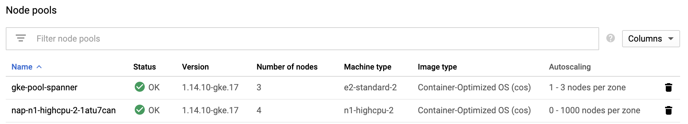
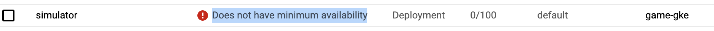

## Overview

| Item        | Feature  |
| ------------- |:-------------:|:-------------:|
| How to scale cluster to support simulator instances | [VPA](https://cloud.google.com/kubernetes-engine/docs/how-to/vertical-pod-autoscaling?hl=zh-tw#getting_resource_recommendations) |
| When players increases, I want to see my MUD pod scales out      | HPA | 
| When players increases hugely, I want to see my cluster scales out accordingly     | VPA and [Node auto provisioning](https://cloud.google.com/kubernetes-engine/docs/how-to/node-auto-provisioning), cluster auto scale      |
--------

### Scale my Simulator

I will have simulator and mud running on my GKE cluster, I want to have them running on different node pools for better management.

- In order to fo that, I am enabling [Node auto provisioning](https://cloud.google.com/kubernetes-engine/docs/how-to/node-auto-provisioning) and [Cluster auto-scaling](https://cloud.google.com/kubernetes-engine/docs/how-to/cluster-autoscaler?hl=zh-tw)

>CAUTION: Enabling Cluster Autoscale can cause GKE master to restart

    -   Please be sure to specify "--autoprovisioning-service-account" so that we can configure IAM permission for it when required
    -   Service Account must have Storage Object Viewer and Storage Admin permission
```bash
# Enable cluster auto-scaling for default node pool
export CLUSTER=game-gke
export ZONE=asia-east1-a
export POOL=gke-pool-spanner
gcloud container clusters update $CLUSTER --enable-autoscaling \
    --min-nodes 1 --max-nodes 3 --zone $ZONE --node-pool $POOL
    
# Enable node auto provisioning on my default node pool so that GKE automatically creates new node pool when required
# Note that below is the total CPU/Memory allocated to this cluster, auto-provisioned nodes count agianst this total
gcloud container clusters update $CLUSTER \
  --enable-autoprovisioning \
  --min-cpu 2 \
  --min-memory 4 \
  --max-cpu 32 \
  --max-memory 64 \
  --zone $ZONE \
  --autoprovisioning-service-account $SVC_ACCT 

gcloud container node-pools update $POOL --enable-autoprovisioning
```


- Create a Node Pool for simulator and game server to run


>Note that in order to have container able pull images from registry, you have to specify storage-ro or storage-full scope
>Otherwise you would see a lot of ImagePullBackoff error.


```bash
export CLUSTER=game-gke
export ZONE=asia-east1-a
export POOL=gke-pool-spanner
gcloud container node-pools create "simulator" \
      --cluster $CLUSTER --zone $ZONE --machine-type "n1-highmem-2" --image-type "COS" \
      --disk-size "10" --node-labels=dedicated=simulator \
      --node-taints dedicated=simulator:NoSchedule \
      --enable-autoscaling --num-nodes "1" --min-nodes="1" --max-nodes="10" \
      --scopes gke-default,default,storage-full
gcloud container node-pools update "simulator"  --cluster $CLUSTER --enable-autoprovisioning --zone $ZONE

gcloud container node-pools create "mud" \
      --cluster $CLUSTER --zone $ZONE --machine-type "n1-highmem-2" --image-type "COS" \
      --disk-size "10" --node-labels=dedicated=mud \
      --node-taints dedicated=mud:NoSchedule \
      --enable-autoscaling --num-nodes "1" --min-nodes="1" --max-nodes="10" \
      --scopes gke-default,default,storage-full
gcloud container node-pools update "mud"  --cluster $CLUSTER --enable-autoprovisioning --zone $ZONE
```

- Now I want all my simulators running on same node pool, in order to do that I am [specifying node affinity, tolerations and taints](./tests/k8s/simulator-deployment.yaml)

>Note that althougth I enabled cluster auto scaling and node auto provisioning, since I have nodeAffinity configured, POD will only be scheduled to node pool I manually created.

- Now that I update my deployment to have 100 replicas and deploy to GKE clsuter, I can see new node pool created.


However, when check my workload, I can see errors in console. This error typically occurs when there is no sufficient CPU and memory to allocate pods.


- So now I need to know how much CPU/RAM required for a simulator to run, to do this I need to get recommendations for my simulator

```yaml
apiVersion: autoscaling.k8s.io/v1
kind: VerticalPodAutoscaler
metadata:
  name: simulator-vpa
spec:
  targetRef:
    apiVersion: "apps/v1"
    kind:       Deployment
    name:       simulator
  updatePolicy:
    updateMode: "Off"
```

- I've also clone and modified my [simulator deployment yaml](./tests/k8s/simulator-deployment-1-replica.yaml) to have only 1 replica

```bash
export CLUSTER=game-gke
export ZONE=asia-east1-a
#   Enable VPA on GKE cluster
gcloud container clusters update $CLUSTER --enable-vertical-pod-autoscaling --zone $ZONE
kubectl apply -f ./k8s/simulator-deployment.yaml
kubectl create -f ./k8s/simulator-vpa-off.yaml 
```

- Let it run for a while then I can get recommendation

```bash
kubectl get vpa simulator-vpa --output yaml
```

Sample output
```yaml
# ...
  recommendation:
    containerRecommendations:
    - containerName: simulator
      lowerBound:
        cpu: 25m
        memory: 262144k
      target:
        cpu: 25m
        memory: 262144k
      uncappedTarget:
        cpu: 25m
        memory: 262144k
      upperBound:
        cpu: 123m
        memory: 262144k
```
- Now that we have mininum and maxinum requirements for simulator to run, I can than modify my deplpyment yaml to reflect this requirement

```yaml
spec:
    containers:
    -   name: simulator
        image: gcr.io/kalschi-agones/simulator:v1
        imagePullPolicy: Always
        env:
            - name: HOST
                value: 34.102.250.216
        resources:
            requests:
            cpu: 50m
            memory: 262144k
```

- Apply new configuration
```bash
kubectl apply -f ./k8s/simulator-deployment.yaml
```

--------
### Scale my MUD Game

When players increases, I want to see my MUD pod scales out. But before I can really scale my MUD game I need to first scale my simulator to generate more traffic.

-   Again, let me get recommendations by creating [VPA](./k8s/mud-vpa-off.yaml) to MUD

```bash
kubectl apply -f ./k8s/mud-deployment-1-replica.yaml
kubectl create -f ./k8s/mud-vpa-off.yaml 

kubectl get vpa mud-vpa --output yaml
```

Outpuy
```yaml
  recommendation:
    containerRecommendations:
    - containerName: mud
      lowerBound:
        cpu: 25m
        memory: "1737709881"
      target:
        cpu: 25m
        memory: "3304504865"
      uncappedTarget:
        cpu: 25m
        memory: "3304504865"
      upperBound:
        cpu: 122m
        memory: "3717783222"
```

- Based on recommendation, modify my MUD deployment

```yaml
resources:
    requests:
        cpu: 50m
        memory: 3.5G  
```

-   Apply new configuration

-   From the recommendation, I understand my MUD game requires memory more than CPU, so I want to scale my game server by memory usage, this is support via "autoscaling/v2beta2"

```yaml
apiVersion: autoscaling/v2beta1
kind: HorizontalPodAutoscaler
metadata:
  name: mud-hpa
spec:
  scaleTargetRef:
    apiVersion: apps/v1
    kind: Deployment
    name: mud
  minReplicas: 1
  maxReplicas: 10
  metrics:
  - type: Resource
    resource:
      name: cpu
      targetAverageUtilization: 50
  - type: Resource
    resource:
      name: memory
      targetAverageValue: 2500Mi
```
## Tests

1. Delete "simulator" node pool, deploy Simulator
-   GKE provision new node pool
-   Simulators scheduled on to newly created node pool

2. Create "sumulator" node pool, delete auto-created node pool, deploy Simulator
-   Simulator pods scheduled to "Simulator" node pool

## Observation

- If I created a node pool with everything fit node requirements, POD scheduled to that node pool. However, POD can always failed to pull images from container registry, so I end up with pre-create node pool.

- If no suitable node pool or nodes, when Node Auto Provisioning is enabled, GKE automatically create node pool with all requirement met. However, some permissions may be missing for these automatically created nodes.
